# 專案邏輯 Diagram

本文件依據目前專案的 Prisma schema、server actions、API routes、dashboard pages 與 shared libs 整理。除資料模型關係圖外，所有流程圖都包含菱形判斷節點，方便看出實際行為分支。

## 1. 登入與路由保護

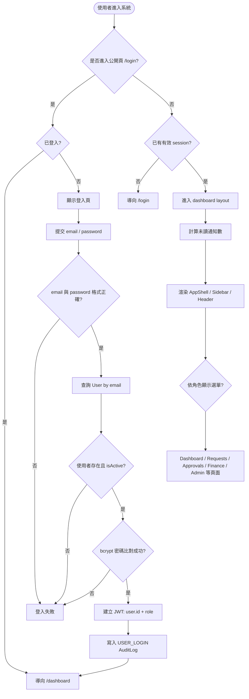

## 2. 請款主流程

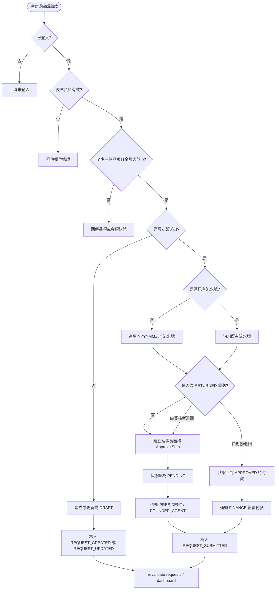

## 3. 請款簽核與狀態分支

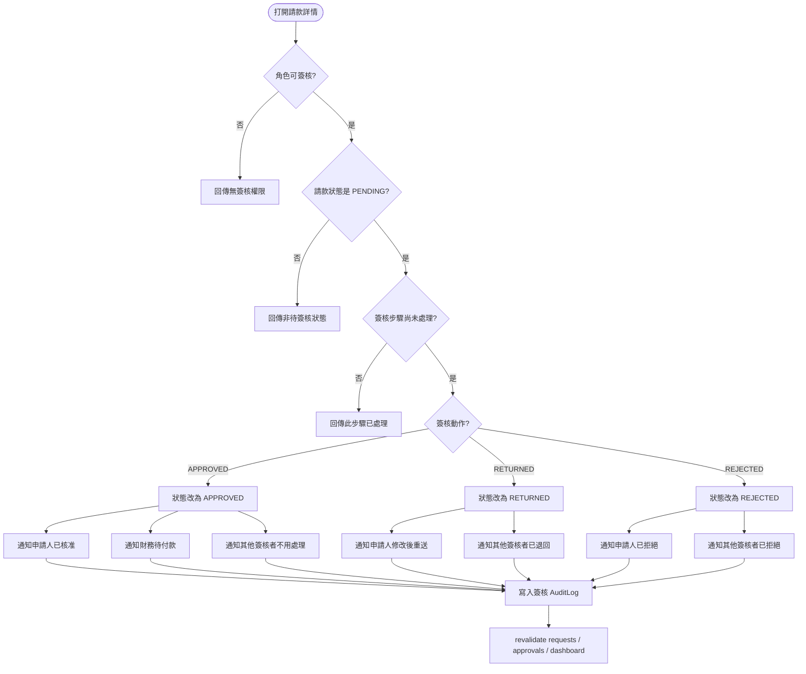

## 4. 抽單、財務退回與付款

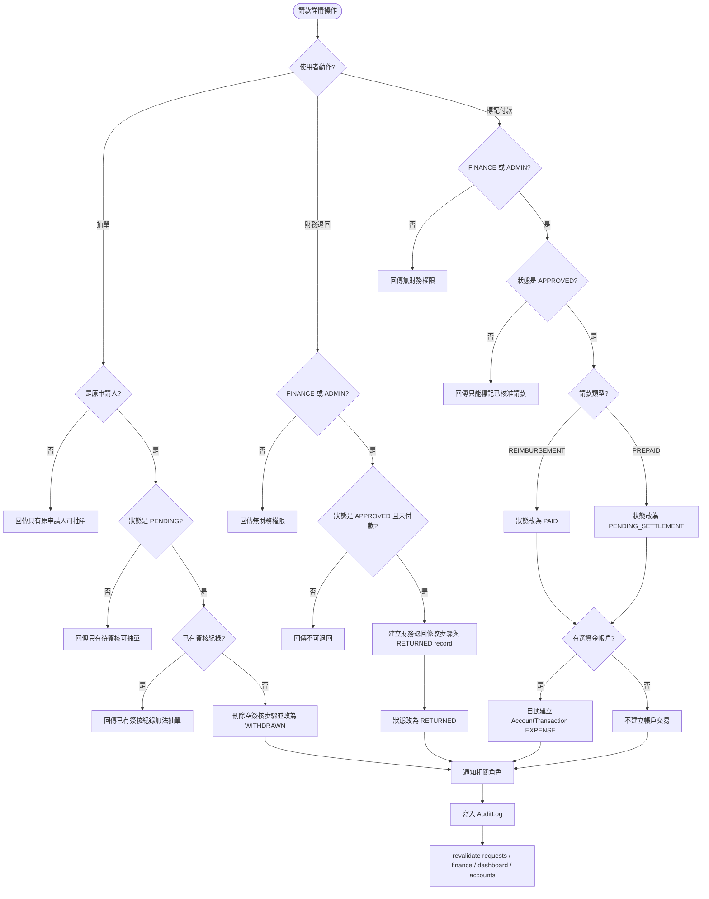

## 5. 預付請款沖銷

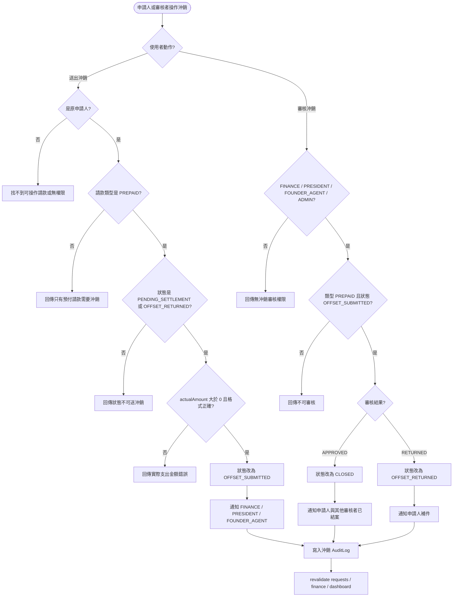

## 6. 附件上傳與讀取

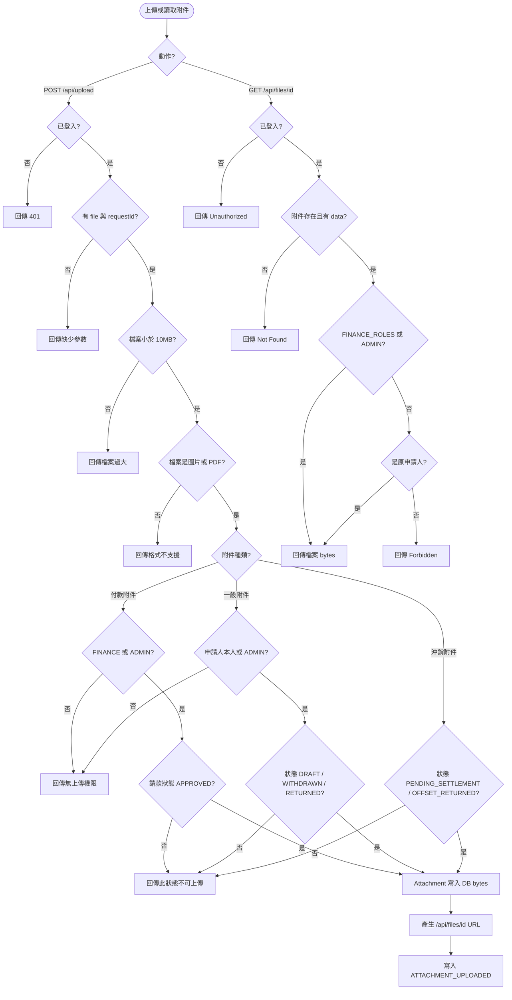

## 7. 通知、推播與稽核副作用

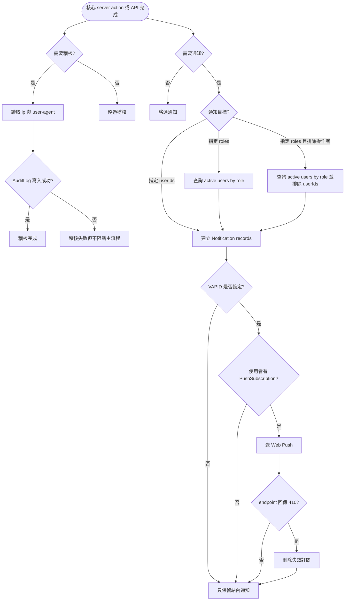

## 8. 資金帳戶與手動交易

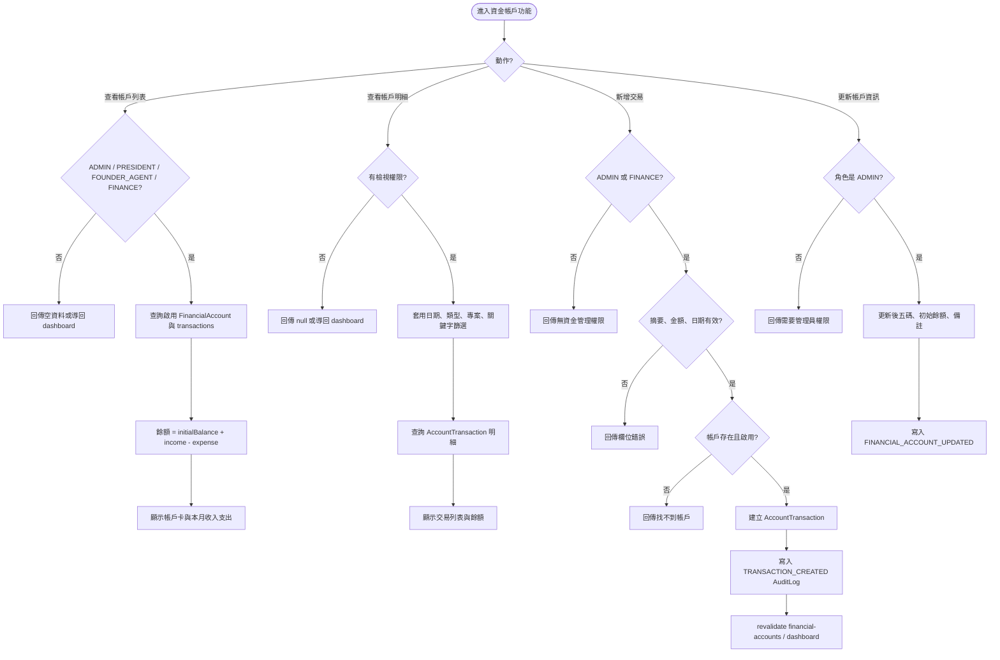

## 9. 付款調整

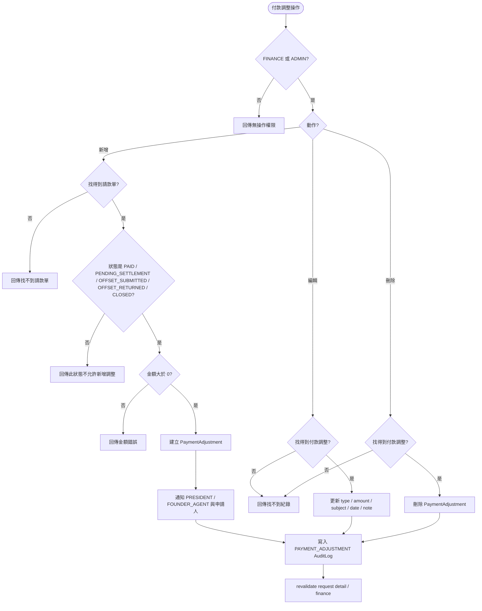

## 10. 專案收支表流程

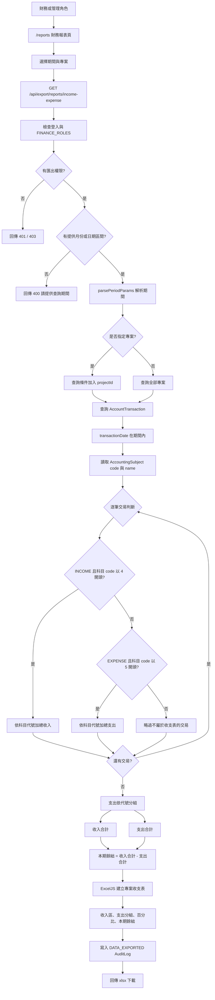

## 11. 資產負債表流程

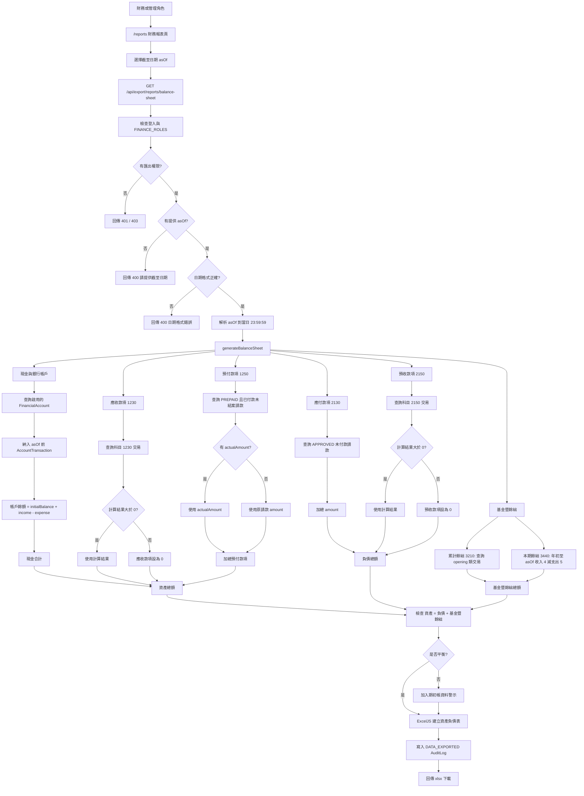

## 12. 管理功能與權限

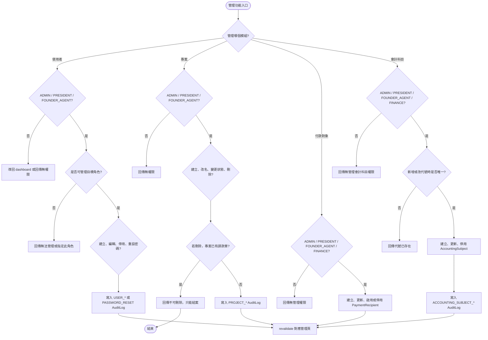

## 13. 核心資料模型關係

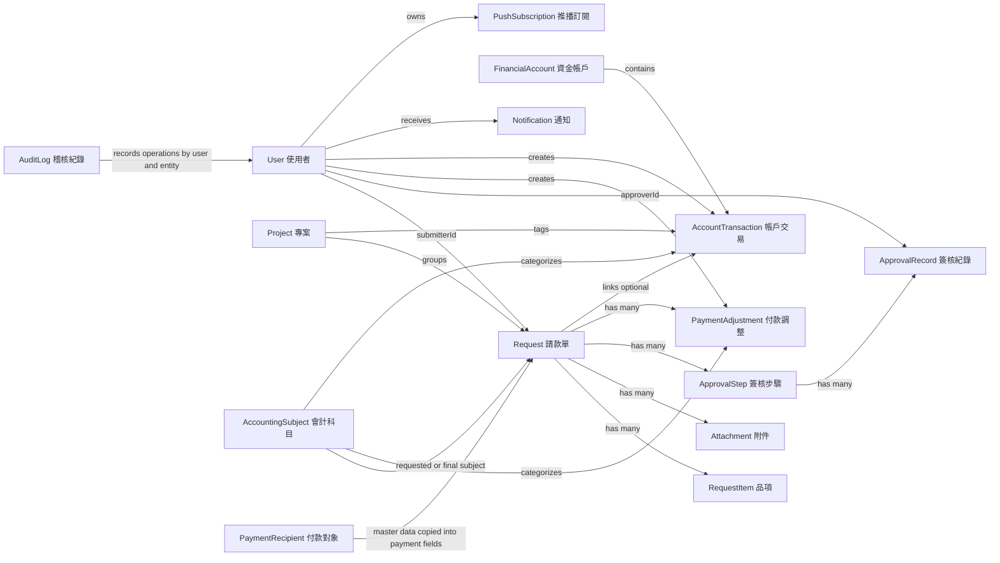

## 主要依據

- `prisma/schema.prisma`
- `src/lib/auth.ts`
- `src/proxy.ts`
- `src/lib/actions/request.ts`
- `src/lib/actions/financialAccount.ts`
- `src/lib/actions/paymentAdjustment.ts`
- `src/lib/actions/project.ts`
- `src/lib/actions/user.ts`
- `src/lib/actions/paymentRecipient.ts`
- `src/lib/notifications.ts`
- `src/lib/audit.ts`
- `src/lib/reports.ts`
- `src/app/api/upload/route.ts`
- `src/app/api/files/[id]/route.ts`
- `src/app/api/accounting-subjects/*`
- `src/app/api/export/*`
- `src/app/(dashboard)/*`
